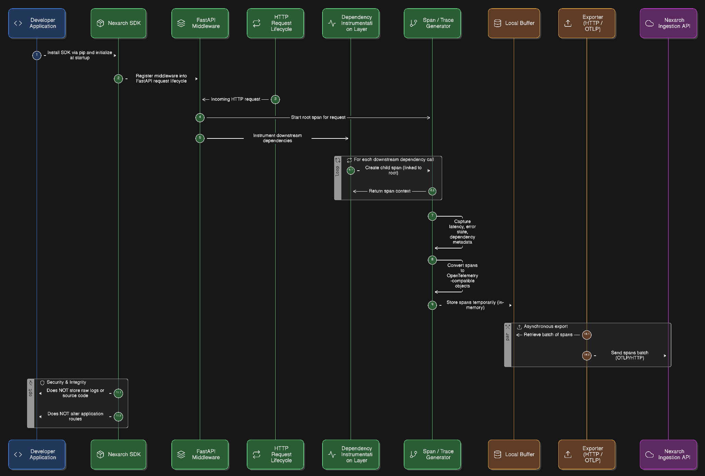

# Nexarch

## Project Overview
Nexarch is a B2B Architecture Intelligence Platform that understands how a software system actually works in production. Instead of relying on source code or static documentation, Nexarch observes runtime behavior (request flows, service interactions, dependencies, and performance signals) to reconstruct the system’s real architecture. It then detects bottlenecks and architectural issues and generates multiple improved architecture workflows (e.g., performance-focused, cost-optimized, low-risk) with clear comparisons. The goal is to help teams make fast, confident, data-backed architectural decisions and keep systems production-ready as they evolve.

## Problem Statement
As Now a days software systems grow, and their real production architecture mostly becomes unclear. Teams no longer know how requests actually move through services, databases, and APIs. This actually makes it hard to find bottlenecks, fix performance issues, as well as decide how the system should be improved. Present time tools show logs and metrics, however they do not explain the system’s structure or guide about the architectural decisions.
### Modern applications face critical challenges:

- **Invisible Architecture Drift**: Production architecture diverges from documentation as systems evolve
- **Performance Bottlenecks**: Teams lack visibility into actual request flows and dependency chains
- **Optimization Uncertainty**: No data-backed way to evaluate architectural changes before implementation
- **Manual Analysis Overhead**: Architecture reviews require extensive manual tracing and documentation

Traditional solutions require source code access, manual instrumentation, or disruptive changes to existing systems.

## Solution

Nexarch solves this by understanding applications from how they run in production. By using our lightweight SDK, Nexarch observes live request flows, service connections, and performance behaviour without accessing source code or sensitive data. From this runtime information, it automatically rebuilds workflow of better architectural design based on the system’s actual architecture and highlights problem areas.

Nexarch then generates multiple improved architecture designs with workflow's options which actually focused on performance, cost, or low-risk changes. Each of the generated option is compared using clear metrics like speed, reliability, cost, and complexity. This helps teams make confident, data-backed architecture decisions faster, even helps to make a better production ready scalable system.

Atlast user will get to know some interesting information about there whole architecture and workflow pipelines, so that there system never get messed up and work as production ready. It is actually a better system visibility platform, which reduce manual analysis, lower risk during changes, and continuous clarity as applications evolve so that in future if anything new came up which can help, then developers can evolve there architecture and workflow based on it.

1. **Observability SDK**: Lightweight middleware that captures application behavior without business logic changes
2. **Analysis Engine**: Reconstructs actual architecture from distributed tracing data and pattern recognition
3. **Workflow Generator**: Produces multiple optimized architecture alternatives with quantitative comparisons

## What Nexarch Is Not

- Not a logging platform or log aggregation tool
- Not a monitoring dashboard or metrics collector
- Not a replacement for APM tools like DataDog or New Relic
- Not a source code analyzer or static analysis tool

Nexarch operates on top of runtime signals to reason about architecture patterns, bottlenecks, and optimization opportunities.

## How It Works

### Phase 1: SDK Integration

Install the Nexarch SDK into your application:

```bash
# Python
pip install nexarch-sdk

# Node.js
npm install nexarch-sdk

# Java
mvn install nexarch-sdk
```

Initialize in your application:

```python
from nexarch import NexarchSDK

sdk = NexarchSDK(api_key="your_api_key")
sdk.start()
```

The SDK integrates as middleware or agent-based instrumentation. No business logic changes or routing modifications required. Application restart may be needed for initial SDK registration.

### Phase 2: Runtime Observation

The SDK captures runtime telemetry through instrumentation hooks:

- **HTTP Tracing**: Wraps HTTP entry points and outbound requests to measure latency and status codes
- **Database Instrumentation**: Hooks into database drivers (SQLAlchemy, psycopg, etc.) to track query patterns and connection behavior
- **Dependency Detection**: Traces calls to external services, message queues, and cache layers through library-level instrumentation
- **Error Tracking**: Captures exception types, frequencies, and failure points without stack trace details
- **Span Correlation**: Links related operations using distributed tracing techniques (trace IDs, span IDs)

The SDK emits structured spans compatible with OpenTelemetry standards:

```json
{
  "trace_id": "abc123",
  "span_id": "span-456",
  "parent_id": null,
  "service": "api-service",
  "operation": "GET /users",
  "latency_ms": 120,
  "kind": "server",
  "status": "ok",
  "downstream": ["database", "cache"]
}
```

Observation period: 2-3 hours of production traffic (configurable based on traffic volume).

Data collected includes only behavioral metadata and spans. Source code, request payloads, query parameters, and business data are never accessed or transmitted.

### Phase 3: Architecture Reconstruction

The Nexarch platform processes collected spans to build a dependency graph:

1. **Graph Construction**: Converts spans into nodes (services, databases, external APIs) and edges (dependencies with latency, throughput, error rate)
2. **Request Flow Mapping**: Traces actual request paths through the system using span correlation
3. **Pattern Detection**: Applies algorithmic rules to identify synchronous call chains, fan-out patterns, single points of failure
4. **Bottleneck Analysis**: Calculates critical path latency, identifies hot spots, detects resource contention
5. **Architecture Classification**: Categorizes architecture patterns (monolith, microservices, event-driven, layered)

Graph schema example:

```
Node(id=api-service, type=service)
  ↓ avg_latency=120ms, rps=50, error_rate=0.01
Node(id=auth-service, type=service)
  ↓ avg_latency=80ms, rps=50, error_rate=0.005
Node(id=users-db, type=database)
```

Output: Verified current architecture model as a queryable graph with performance metrics.

### Phase 4: Workflow Generation

The platform generates 2-3 alternative architectures optimized for different objectives:

**Workflow 1: Minimal Migration**

- Incremental improvements to existing architecture
- Low implementation risk
- Focuses on quick wins and bottleneck removal

**Workflow 2: High Performance**

- Optimized for throughput and latency
- Modern technology stack recommendations
- Designed for scale and reliability

**Workflow 3: Cost Optimization**

- Resource efficiency focused
- Strategic caching and batching
- Reduced operational overhead

Each workflow includes:

- Architecture diagram showing proposed changes
- Technology stack recommendations based on detected patterns (e.g., add cache layer, introduce message queue, split service)
- Data flow modifications with before/after comparisons
- Implementation complexity score (low/medium/high)
- Migration path with risk analysis and effort estimation

Workflow generation combines rule-based pattern matching with optimization algorithms. Future versions will incorporate AI-powered customization based on broader architectural knowledge.

### Phase 5: Comparative Analysis

The platform provides side-by-side comparison across:

- **Performance**: Latency improvements, throughput capacity, resource efficiency
- **Reliability**: Fault tolerance, error handling, resilience patterns
- **Cost**: Infrastructure costs, operational overhead, scaling economics
- **Complexity**: Implementation effort, migration risk, maintenance burden
- **Scalability**: Growth capacity, bottleneck elimination, horizontal scaling readiness

Output: Quantitative comparison matrix with recommendation scoring.

## Key Features

### Runtime-Only Analysis

- No source code access required
- No business logic changes needed (middleware integration required)
- Minimal configuration overhead
- Language-agnostic architecture with Python SDK in MVP (Node.js and Java SDKs in roadmap)

### Comprehensive Architecture Intelligence

- Automatic architecture diagram generation
- Real request flow visualization
- Dependency graph mapping
- Performance heatmap identification

### Data-Backed Recommendations

- Multiple workflow alternatives
- Quantitative comparison metrics
- Technology stack suggestions
- Implementation risk assessment

### Enterprise Security

- No source code transmission
- Configurable data retention
- Privacy-focused data collection
- Compliance-ready architecture

## Platform Overview

Nexarch provides a Next.js-based web platform for centralized architecture intelligence and observability.

### Account and Project Management

**Getting Started:**

1. Create an account on the Nexarch platform
2. Set up a new project for your application
3. Generate API credentials and SDK integration endpoints
4. Configure SDK in your application using provided API key
5. View your application in the platform dashboard once SDK begins transmitting data

### Dashboard Capabilities

Once your application is integrated, the platform provides:

**Real-Time Architecture Visibility:**

- Live dependency graph showing all services, databases, and external APIs
- Current architecture diagram with component relationships
- Request flow visualization through your system
- Service health status and availability metrics

**Performance Analytics:**

- Backend server performance metrics (latency, throughput, error rates)
- Endpoint-level performance breakdown
- Database query performance analysis
- Resource utilization trends
- Bottleneck identification with severity scoring

**Issue Detection and Monitoring:**

- Active error tracking with frequency and impact analysis
- Performance degradation alerts
- Architectural anti-pattern detection
- Single point of failure identification
- Scalability constraint warnings

**Architecture Optimization:**

The platform generates 3-4 alternative architecture workflows optimized for different objectives:

1. **Minimal Change Workflow**: Incremental improvements with low migration risk
2. **High Performance Workflow**: Optimized for throughput and latency reduction
3. **Cost-Optimized Workflow**: Resource efficiency and operational cost reduction
4. **Future-Scale Workflow**: Designed for long-term growth and scalability

Each proposed workflow includes:

- Visual architecture diagram showing proposed changes
- Technology stack recommendations (caching layers, message queues, service decomposition, database optimization)
- Detailed comparison with current architecture across multiple dimensions:
  - **Performance Impact**: Expected latency improvements, throughput capacity increase
  - **Cost Analysis**: Infrastructure cost delta, operational overhead changes
  - **Scalability**: Growth capacity, horizontal scaling readiness
  - **Complexity**: Implementation effort, migration risk assessment, team skill requirements
  - **Reliability**: Fault tolerance improvements, resilience patterns
- Pros and cons for each technology choice
- Migration path with step-by-step implementation guidance
- Risk assessment and mitigation strategies

**Intelligent Recommendations:**

The platform analyzes your specific application characteristics to recommend the optimal architecture:

- Pattern-matched against industry best practices
- Considers your traffic patterns, data access patterns, and scaling requirements
- Suggests specific technologies and architectural patterns (microservices decomposition, event-driven architecture, CQRS, caching strategies)
- Prioritizes recommendations by impact and implementation feasibility
- Provides rationale for each suggestion based on observed behavior

The platform's goal is to identify the architecture that makes your application scalable, resilient, and maintainable while balancing implementation complexity and business constraints.

## Installation

### Prerequisites

- Application with HTTP/HTTPS endpoints
- Network connectivity to Nexarch platform
- API key from Nexarch dashboard

### SDK Installation

**Python:**

```bash
pip install nexarch-sdk
```

**Node.js:**

```bash
npm install nexarch-sdk
```

**Java:**

```xml
<dependency>
    <groupId>com.nexarch</groupId>
    <artifactId>nexarch-sdk</artifactId>
    <version>1.0.0</version>
</dependency>
```

### Configuration

```python
from nexarch import NexarchSDK

sdk = NexarchSDK(
    api_key="your_api_key",
    observation_duration="3h",
    sampling_rate=1.0,
    environment="production"
)

sdk.start()
```

## Usage

### Complete Workflow

1. **Platform Setup**: Create account on Nexarch platform and set up your project
2. **Generate Credentials**: Obtain API key and SDK integration endpoints from platform
3. **SDK Integration**: Install and initialize SDK in your application with provided credentials
4. **Observation Period**: Allow SDK to observe production traffic (2-3 hours minimum recommended)
5. **Dashboard Access**: View your application in the platform as data begins flowing
6. **Architecture Analysis**: Review current architecture visualization, performance metrics, and detected issues
7. **Workflow Exploration**: Explore 3-4 generated architecture alternatives with detailed comparisons
8. **Technology Comparison**: Analyze pros/cons of different tech stack options for your use case
9. **Decision Support**: Review platform recommendations and optimization suggestions
10. **Implementation**: Export detailed implementation guide for your selected architecture workflow

### API Access

All analysis results are available via REST API:

```bash
# Get current architecture
GET /api/v1/architecture/current

# Get generated workflows
GET /api/v1/workflows/generated

# Get comparison matrix
GET /api/v1/workflows/comparison

# Get implementation guide
GET /api/v1/workflows/{workflow_id}/implementation
```

### Platform Dashboard Features

**Project Management:**

- Multi-application support with project organization
- Team collaboration and role-based access control
- Environment separation (production, staging, development)

**Visualization and Analytics:**

- Real-time architecture visualization with live updates
- Interactive dependency graphs with drill-down capabilities
- Performance metric dashboards with customizable time ranges
- Error rate tracking with historical trends
- Endpoint performance heatmaps
- Service health scorecards

**Architecture Intelligence:**

- Current architecture overview with component inventory
- Detected issues and bottlenecks with severity levels
- Side-by-side workflow comparison interface
- Technology stack analysis with adoption recommendations
- Scalability assessment scores

**Recommendations Engine:**

- Prioritized optimization suggestions based on impact
- Best-fit architecture recommendation with justification
- Migration complexity scoring
- Cost-benefit analysis for proposed changes

**Export and Integration:**

- Export capabilities (PDF reports, JSON data, architecture diagrams)
- Implementation guides with code snippets
- Webhook notifications for critical issues
- API access for programmatic integration

## Use Cases

### Performance Optimization

Identify and eliminate bottlenecks in production systems without manual tracing or guesswork.

### Architecture Modernization

Evaluate migration paths from monolith to microservices with data-backed recommendations.

### Technology Stack Evaluation

Compare current implementation against modern alternatives with quantitative impact analysis.

### Capacity Planning

Understand actual system behavior to inform scaling decisions and infrastructure investments.

### Technical Debt Assessment

Quantify architectural issues and prioritize improvements based on measured impact.

## Impact

### For Development Teams

- **Reduced Analysis Time**: Automatic architecture discovery eliminates weeks of manual documentation
- **Informed Decisions**: Data-backed recommendations replace guesswork and assumptions
- **Risk Mitigation**: Understand migration complexity before committing resources

### For Engineering Organizations

- **Architecture Visibility**: Maintain accurate understanding of production systems as they evolve
- **Optimization ROI**: Quantify performance improvements before implementation
- **Knowledge Transfer**: Onboard new engineers faster with visual architecture documentation

### For Business Outcomes

- **Faster Time to Market**: Reduce architecture planning cycles from weeks to hours
- **Cost Efficiency**: Identify optimization opportunities with clear cost-benefit analysis
- **System Reliability**: Proactive identification of architectural weaknesses before they cause outages

## Technical Architecture

### SDK Workflow

The Nexarch SDK operates through instrumentation and telemetry collection:



**SDK Components:**

- **Request Interceptor**: Captures HTTP request/response metadata
- **Dependency Tracer**: Tracks downstream service and database calls through library-level hooks
- **Span Generator**: Creates OpenTelemetry-compatible spans with trace correlation
- **Local Buffer**: Temporarily stores spans in memory before batch export
- **Data Sanitizer**: Ensures sensitive information is never transmitted
- **Exporter**: Sends sanitized spans via HTTP/OTLP to ingestion API

The SDK integrates as middleware in FastAPI, Django, Flask, or other frameworks, hooking into the request lifecycle to capture timing, error, and dependency information without blocking application logic.

### Platform Architecture

The backend processes spans through multiple analysis stages:


**Platform Components:**

- **Ingestion API**: FastAPI endpoints for SDK data collection with validation layer
- **Raw Span Storage**: Persistent storage for all received telemetry data
- **Async Processing Queue**: Decouples ingestion from analysis for scalability
- **Span Processor**: Groups and builds dependency graphs from correlated spans
- **Dependency Graph Builder**: Constructs service graph with weighted edges
- **Architecture Reconstruction Engine**: Analyzes graph to identify patterns and architecture style
- **Rule-based Pattern Detection**: Applies algorithmic rules to detect issues (deep call chains, bottlenecks, SPOFs)
- **Workflow Generator**: Template-based architecture pattern recommendations with optimization scoring
- **Comparison Engine**: Multi-dimensional workflow evaluation system with cost and complexity modeling
- **REST API Layer**: Exposes all analysis results via JSON endpoints
- **Visualization Service**: Generates architecture diagrams and comparison reports

### Data Flow

```
SDK (Runtime) → Ingestion API → Raw Storage → Async Queue → Processing Engine → Analysis Engine → Workflow Generator → Comparison Engine → REST API → Dashboard/Client
```

## Security and Privacy

### Data Collection Policy

**Collected:**

- Endpoint URLs and HTTP methods
- Response times and status codes
- Dependency connection patterns
- Error types and frequencies
- Resource utilization metrics

**Never Collected:**

- Source code or application logic
- Request/response payloads
- Authentication credentials
- Business data or PII
- Database query contents
